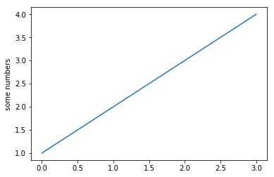

# Inaugural Address Analysis

by Na-Rae Han

## 0. Introduction
... ...

## 1. Background
... ...

## 2. Data sourcing
... ...

## 3. Data cleanup
... and here I am, pointing to a [particular section](https://nbviewer.jupyter.org/github/Data-Science-for-Linguists-2025/Inaugural-Address-Analysis/blob/main/process_data.ipynb#Second-section) in my very long Jupyter Notebook. Note that I am linking to the **jupyter nbviewer**'s rendered view. (Linking to the GitHub's version would be [like this](process_data.ipynb#Second-section), only that _it does not work_. More info in the [guildelines](https://naraehan.github.io/Data-Science-for-Linguists-2025/project#final).)   

## 4. Analysis
... Again, make sure to link to [relevant sections of your JNB code](https://nbviewer.jupyter.org/github/Data-Science-for-Linguists-2025/Inaugural-Address-Analysis/blob/main/process_data.ipynb#Third-section) on nbviewer. Plots can be embedded too, like below. Click the `Raw` button above to see my Markdown source code. 

## 5. Conclusion
... ...
